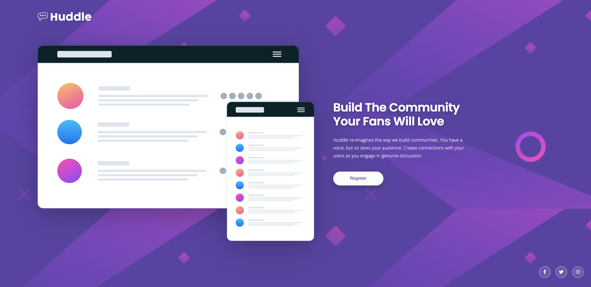
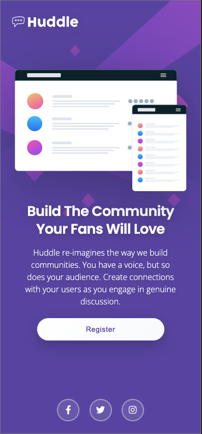

# 🚀 Projeto: Huddle Landing Page

Este projeto foi desenvolvido como parte da **Quest HTML + CSS Avançado** do curso **Dev em Dobro**, com base em um desafio proposto pela plataforma [Frontend Mentor](https://www.frontendmentor.io/).

O objetivo é aplicar técnicas modernas de HTML5 e CSS3, com foco em layout responsivo, design visual profissional e boas práticas de código.

---

## 🧩 Desafio

Criar uma landing page fiel ao layout fornecido, com:

- Estrutura semântica
- Estilo visual moderno
- Responsividade completa
- Acessibilidade básica
- Animações suaves
- Boas práticas de organização de código

---

## 🛠️ Tecnologias Utilizadas

- **HTML5**
- **CSS3 (incluindo media queries e reset)**
- **Font Awesome** para ícones sociais
- **Google Fonts** (Poppins e Open Sans)

---

## 🖥️ Layout e Responsividade

- 💻 **Versão Desktop**: imagem à esquerda, texto à direita, footer flutuando com ícones sociais.
- 📱 **Versão Mobile**: conteúdo empilhado e centralizado, imagem acima do texto, botão expandido.

---

## ✨ Funcionalidades e Melhorias

- ✅ Layout 100% responsivo com `media queries`
- ✅ Uso de `reset.css` para consistência entre navegadores
- ✅ Estilização moderna com `estilos.css`
- ✅ Separação de arquivos para manter organização
- ✅ Footer fixado de forma elegante
- ✅ Animação suave ao carregar (`fadeIn`)
- ✅ Ícones sociais acessíveis com `aria-label` e `title`
- ✅ Botão semântico com `type="button"`

---

## 📷 Prévia do Projeto

### 💻 Versão Desktop


### 📱 Versão Mobile

---

## 📂 Estrutura de Arquivos

```
/src
  /css
    ├── reset.css
    ├── estilos.css
    └── responsivo.css
  /design
    ├── preview-desktop.png
    └── preview-mobile.png
  /designfinal
    ├── desktop-final-design
    └── mobile-final-design
  /images
    ├── bg-desktop.svg
    ├── bg-mobile.svg
    ├── logo.svg
    └── illustration-mockups.svg

index.html
README.md

---

## ▶️ Como rodar o projeto

1. Clone o repositório:
```bash
git clone https://github.com/seu-usuario/huddle-landing-page.git
```

2. Navegue até a pasta:
```bash
cd huddle-landing-page
```

3. Abra o arquivo `index.html` em seu navegador.

## 🌐 Live Site

[Acesse o site publicado aqui](https://brunopenna87.github.io/huddle-landing-page/)

---

## 📚 Créditos

- 🎓 **Dev em Dobro** — Curso HTML + CSS Avançado
- 💡 **Frontend Mentor** — Desafio base
- 👨‍💻 Desenvolvido por: **Bruno Penna** 
https://www.linkedin.com/in/bruno-cesare-penna-e-costa-77951a6a/
